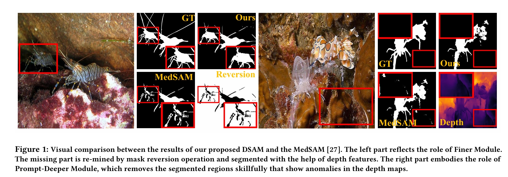

<div align="center">
<h2>Exploring Deeper! Segment Anything Model with Depth Perception for Camouflaged Object Detection</h2>
Zhenni Yu, Xiaoqin Zhang, Li Zhao, Yi Bin, Guobao Xiao
ACM MM, 2024
</div>



## Usage 

### Installation

```bash
git clone https://github.com/guobaoxiao/DSAM
cd DSAM
```

### environment

```bash
conda env create -f environment.yaml
```

## From datasets to npz 
you can load down the COD datasets and run this to get npz for train.
```bash
python pre_npz.py
```

- **COD datasets**:
    download the COD datasets set from [here](https://github.com/lartpang/awesome-segmentation-saliency-dataset#camouflaged-object-detection-cod)(CAMO, COD10K, NC4K), and put into 'data/'

- **depth datasets**:
    download the depth datasets set, put into 'data/'. The depth image is from PopNet.
    
  - 通过百度网盘分享的文件：Train_depth.zip
      链接：https://pan.baidu.com/s/1grcASolza9GLpHIVk8mESQ 
      提取码：wocz
  - 通过百度网盘分享的文件：Test_depth.zip
     链接：https://pan.baidu.com/s/1HobAvMBpfSUfUHNXGZeFLw 
     提取码：32ut


### Weights
- **pre-weigth**:
    download the weight of sam from [here](https://dl.fbaipublicfiles.com/segment_anything/sam_vit_b_01ec64.pth), the weight of pvt form xxx, put into 'work_dir_cod/SAM/'

- **DSAM**:
    download the weight of well-trained DSAM, put into 'work_dir_cod/DSAM'
  - 通过百度网盘分享的文件：DSAM.pth
    链接：https://pan.baidu.com/s/1148mXSjTv7OKlWHcfZFh5A 
    提取码：39xx


### The predicted image
- **DSAM**: 
  -  通过百度网盘分享的文件：DSAM.zip
     链接：https://pan.baidu.com/s/1V5372Z_GdHzYEyOR3iEu4Q 
     提取码：fu49

### Train
```bash
python Mytrain.py
```

### Test

```bash
python Mytest.py
```

### Translate npz to img

```bash
python transformer_nzp_2_gt.py
```

### eval

```bash
python MSCAF_COD_evaluation/evaluation.py
```
## Citation

If you find this project useful, please consider citing:

```bibtex
@article{yu2024exploring,
  title={Exploring Deeper! Segment Anything Model with Depth Perception for Camouflaged Object Detection},
  author={Yu, Zhenni and Zhang, Xiaoqin and Zhao, Li and Bin, Yi and Xiao, Guobao},
  journal={arXiv preprint arXiv:2407.12339},
  year={2024}
}
```
